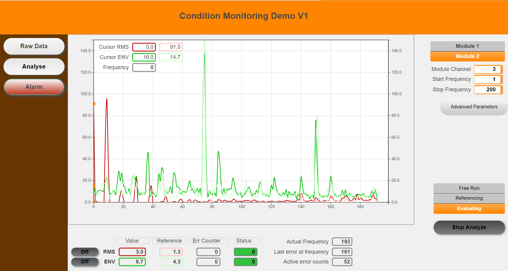

## Introduction
The library “mod_ConMon” simplifies condition monitoring on B&R PLCs. The sample can be used to evaluate and monitor a machine without knowing the damage frequency beforehand. The machine is recorded in “good” condition and then continuously monitored against the reference data. An alarm is triggered if one of the reference value exceeds a certain limit.

See [**See this document for a detailed description of the library.**](Logical/ConditionMonitoring/Description%20condition%20monitoring%20library%20V1.pdf) Download the latest release from [**here.**](../../releases) 
